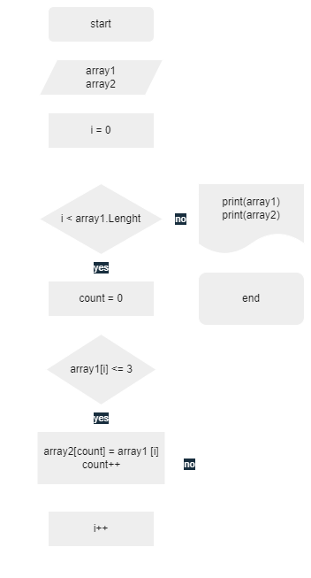

*__Задача:__*

*Написать программу, которая из имеющегося массива строк формирует новый массив из строк, длина которых меньше, либо равна 3 символам. Первоначальный массив можно ввести с клавиатуры, либо задать на старте выполнения алгоритма. При решении не рекомендуется пользоваться коллекциями, лучше обойтись исключительно массивами.*

*__Решение:__*

1. Объявляем два массива одинаковой длины, первый - со строками, второй - пустой.
2. Создаём метод заполнения второго массива из элементов первого с циклом соразмерным длины массива, в котором проверяется условие задачи и элементы подходящие под условие записываются во второй массив.
3. Создаём метод вывода элементов массива на экран.
4. Запускаем метод для обоих массивов, для наглядного сравнения. 

*__Блок-схема:__*

